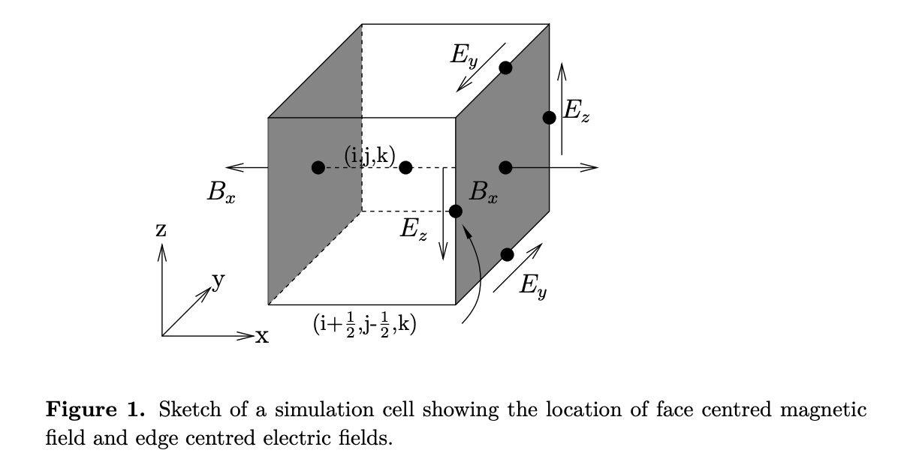
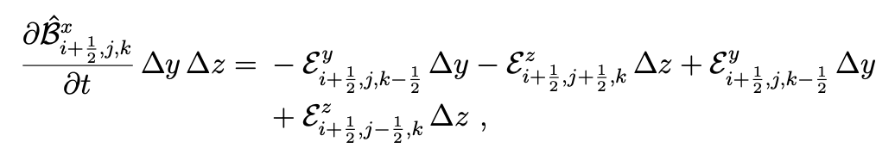
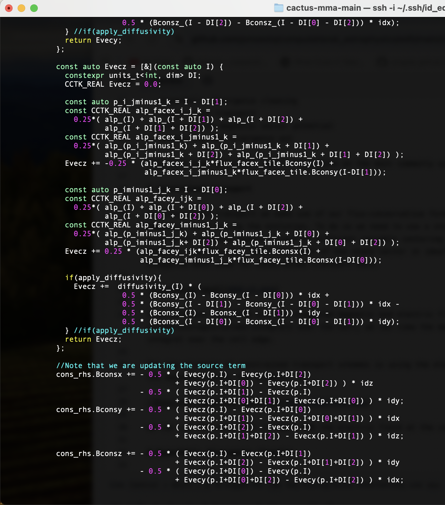

# The div B = 0 constraint

One thing that makes integrating the equations of magnetohydrodynamics more complicated is the additional constraint equation that we have to deal with. The no-monopole constraint that comes from the Maxwell equations 
    
$$\nabla \cdot \vec{B} = 0$$

has to be satisfied when we integrate our evolution equations for the magnetic field. This is trivially true in the limit of infinite resolution (and via the CFL condition infinitely-small timesteps) but turns out to be a problem when we integrate the equations without any additional measures employed. 

There are multiple strategies used by application codes solving the MHD equations:

 - hyperbolic divergence cleaning
 - constrained transport
 - evolving the magnetic vector potential
 - projecting the divergence out

They each have pros/cons. We'll focus here on the most commonly used ones, hyperbolic divergence cleaning and constrained transport.

# Constrained transport

In constrained transport we make use of our flux-conservative formulation to guarantee that even in the discrete system we are not generating any divergence of the magnetic field during the evolution. To do so we need to use a staggered mesh to store the magnetic field $$\vec{B}$$. This adds complications to our finite-volume grid as it involves keeping track of different variable centering in the state vector and requires additional interpolation operations. You can see a sketch of where magnetic and electric field (not part of the state vector in ideal MHD but used for calculating the fluxes in constraint transport) are defined/stored in a fully-staggered mesh used for constrained transport here.
    

    
$\vec{B}$ and $\vec{E}$ are the staggered magnetic and electric field vectors. Similarly to how we interpreted the cell-centered variables of the state vector as volume-averages/volume-integrals over the cell, we can view the magnetic field as the surface integral/average over the cell face and the electric field as the line integral over the cell edge. 

The key strategy of constrained transport schemes is using the electric field components stored at the cell edges to implement the discrete induction equation for the magnetic field. For example, in

we can use the fact that in ideal MHD the electric field at the cell edges can be expressed as $B^k v^i - v^k B^i$.

In code this looks like this

  
# Hyperbolic divergence cleaning
